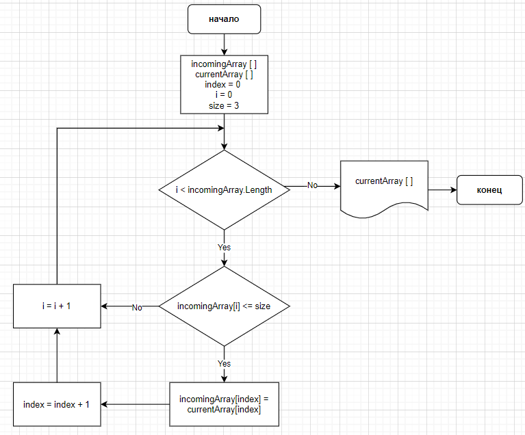

Программа, которая из имеющегося массива строк формирует массив из строк, длина которых меньше либо равно 3 символам. Первоначальный массив задается на старте выполнения алгоритма.

Блок-схема алгоритма: 
